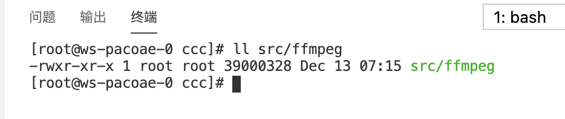
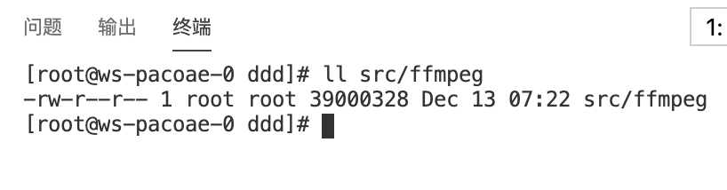

## Permission lost issue for multi-scf component

经测试得到以下结论

1. 对于 scf/http 等 component 未发现执行权限丢失情况
1. 对于 multi-scf component
    1. 当多个函数代码位于同一目录(与 `inputs.src` 相同目录)，权限不会丢失(可使用 `x-permission-lost` 文件夹中事例代码复现)
    
    1. 当定义的多函数位于不同文件夹时会出现权限丢失情况(可使用 `x-permission-lost` 文件夹中事例代码复现)
    

确认该权限丢失 bug 是发生在 multi-scf 组件通过多文件夹部署多个函数时（multi-scf component 内部逻辑）。

## 如何测试
1. 在 codespace 打开或 clone 该 repo
1. 在 `.env` 文件填入 `secrets`
1. 进入 x-permission-remain & x-permission-lost 文件夹，执行 `sls deploy`
1. 至腾讯云 scf 控制台查看 ffmpeg 文件权限
